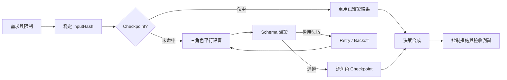

# 多 AI 協作平台｜可驗證工程案例

[](https://github.com/ja9740913/ai-collaboration-platform/actions/workflows/ci.yml)
[](https://ja9740913.github.io/ai-collaboration-platform/)

這個公開 Repository 不再只是展示頁。它提供一條可以在本機執行及測試的「AI 客服導入提案評審」工作流，證明多角色路由、結構化輸出、錯誤重試、穩定輸入指紋與 Checkpoint／Resume 的實作方式。

> 核心主張：把多模型輸出從聊天紀錄，轉成可重跑、可拒絕錯誤格式、可追溯且可驗收的決策流程。

## 30 秒看懂

| 問題 | 公開案例如何處理 |
|---|---|
| 單一模型容易遺漏風險 | `risk`、`delivery`、`user` 三角色平行評審 |
| 模型輸出格式不穩定 | 執行期 Schema 驗證；角色或欄位錯誤直接拒絕 |
| 429／暫時性錯誤中斷流程 | 可分類重試、線性退避並尊重 `retryAfterMs` |
| 重新執行浪費成本 | 穩定 `inputHash` 與 Checkpoint 命中 |
| 輸入改變卻誤用舊結果 | 相同 `runId` 但 Hash 不一致時拒絕續跑 |
| 展示程式可能碰到敏感資料 | 僅使用匿名 Fixture，無 API Key、客戶資料或正式資料庫 |

## 可直接執行

需求：Node.js 24。

```bash
npm install
npm run check
npm run demo
```

`npm run check` 會執行 TypeScript 嚴格型別檢查及 11 個自動測試。`npm run demo` 會重現一場三角色提案評審，其中風險角色第一次模擬 `RATE_LIMITED`，經重試後完成，最後輸出結構化決策與驗收條件。

## 可驗證證據

- [提案評審 Orchestrator](src/orchestrator/proposal-review.ts)：三角色並行、事件軌跡、Checkpoint 與決策合成。
- [輸出 Schema 與執行期驗證](src/schemas/review-output.ts)：拒絕錯誤角色、嚴重度與信心分數。
- [Retry Policy](src/retry-policy.ts)：永久／暫時性錯誤分流、退避與 `retryAfterMs`。
- [穩定輸入指紋](src/input-hash.ts)：物件鍵排序後計算 SHA-256 前綴。
- [Run Store](src/recovery/run-store.ts)：記憶體與原子 JSON Checkpoint，並防止路徑穿越。
- [測試](tests/)：成功流程、重試、Schema、防錯續跑、跨實例 Checkpoint 與安全邊界。
- [GitHub Actions](.github/workflows/ci.yml)：每次 Push／PR 自動執行 `npm ci`、型別檢查、測試與 Demo。

## 代表案例

匿名化情境：四週內是否應將 AI 助理導入客服流程？



詳細說明請見[案例研究](docs/case-study.md)與[架構文件](docs/architecture.md)。

## 責任與 AI 協作邊界

這是一個 AI 協作開發案例，不把所有程式碼宣稱為純人工逐行撰寫。作品擁有者負責問題定義、公開安全邊界、架構取捨、測試驗收與交付責任；AI 用於方案比較、實作草稿、測試案例及文件協作。完整說明見[責任矩陣](docs/ownership.md)。

## 與私人正式平台的界線

私人平台包含更多模型供應商、資料持久化、SSE、權限、工作區與工作流能力。本 Repository 是重新整理的最小公開證據，不包含或複製：

- 私人對話、研究紀錄、客戶或公司資料。
- 正式 SQLite、環境檔、API Key、OAuth Token。
- 可操作本機檔案、CLI、Git Push 或正式部署的權限程式。
- 未經公開證據支持的商業成效數字。

限制與尚未證明的部分完整列在[已知限制](docs/limitations.md)，不以展示便利性掩蓋工程邊界。

## 專案結構

```text
src/          Orchestrator、Schema、Retry、Hash、Run Store
tests/        11 個可重現測試
fixtures/     匿名化輸入與 Provider 腳本
scripts/      命令列 Demo
docs/         架構、案例、責任與限制
index.html    GitHub Pages 互動作品頁
```

## 延伸閱讀

- [系統架構](docs/architecture.md)
- [AI 客服導入案例](docs/case-study.md)
- [責任與 AI 協作矩陣](docs/ownership.md)
- [已知限制](docs/limitations.md)
- [安全政策](SECURITY.md)
