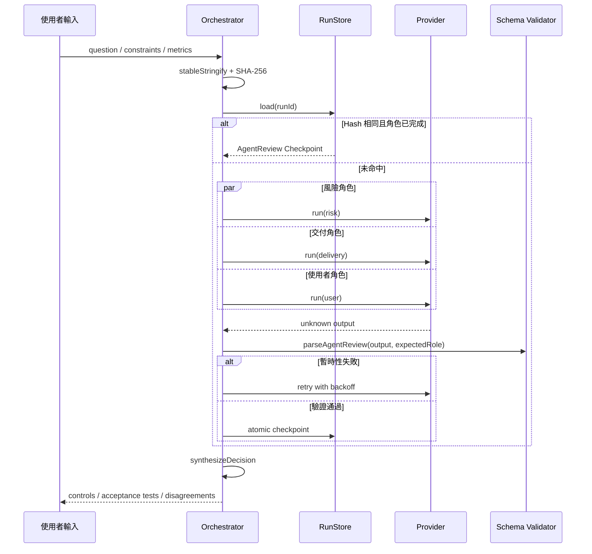

# 系統架構

## 公開案例目標

公開版本只證明一條可重現的「提案評審」工作流。它不需要 API Key，也不假裝 Fixture 是真實模型回應；工程重點是路由、驗證、重試、快取邊界與決策交付。

## 資料流

## 核心設計決策

### 1. Provider 輸出一律視為 `unknown`

外部模型或 Fixture 回傳內容不能直接進入決策層。`parseAgentReview` 會檢查角色、立場、問題清單、嚴重度與信心分數；不合法就以錯誤處理。

### 2. 重試只處理暫時性錯誤

`RATE_LIMITED`、`TIMEOUT` 或暫時無法服務可以重試；權限錯誤與永久失敗立即停止。退避時間取線性退避與 `retryAfterMs` 的較大值。

### 3. Checkpoint 綁定輸入指紋

同一 `runId` 只有在 `inputHash` 相同時才能重用結果。問題、限制或成功指標改變時，系統拒絕沿用舊 Checkpoint，避免把不同任務錯誤視為同一次執行。

### 4. 三角色並行，Checkpoint 序列化寫入

角色執行採 `Promise.allSettled`；Checkpoint 寫入排入單一 Promise Queue，避免平行完成時互相覆蓋。單一角色失敗會保留已完成角色，並以 `failed` 終態收斂。

### 5. 決策合成保持決定論

公開版本不使用第四次模型呼叫合成結論。合成層依三個角色的立場、嚴重度、建議與使用者提供的成功指標產出控制措施、驗收測試與分歧，讓測試可重現。

## 安全邊界

- Fixture 僅為匿名化虛構情境。
- FileRunStore 驗證 `runId`，拒絕 `../` 等路徑穿越。
- 寫檔採同目錄暫存檔後原子 Rename。
- Repository 沒有 API Key、Token、正式資料庫與私人紀錄。
- GitHub Actions 權限為 `contents: read`，Checkout 不保留憑證。

